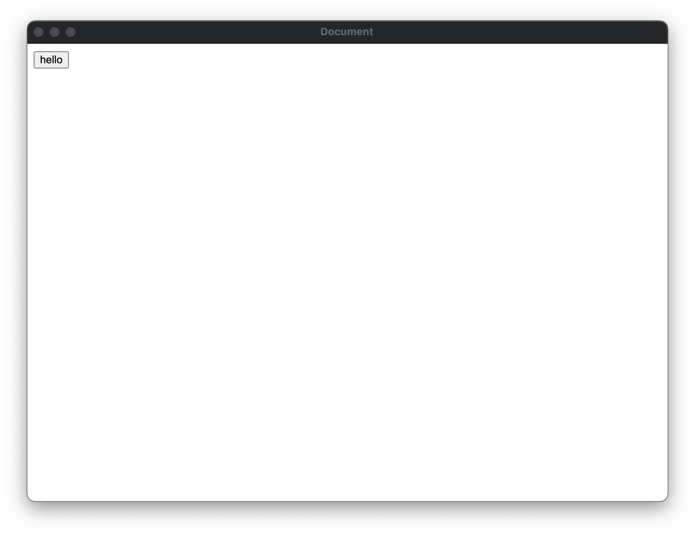

# napi-rs-issue

https://www.electronjs.org/blog/v8-memory-cage

## Reproduction steps

1. run `yarn && yarn build && yarn start`

2. Click hello in the electron window



3. electron crash with error

```
Fatal error in V8: v8_ArrayBuffer_NewBackingStore When the V8 Sandbox is enabled, ArrayBuffer backing stores must be allocated inside the sandbox address space. Please use an appropriate ArrayBuffer::Allocator to allocate these buffers.
```
